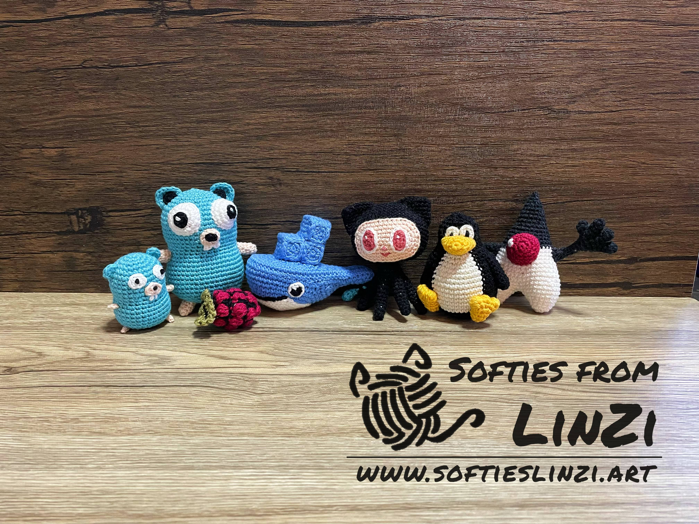

# IT-Related Crochet Amigurumi Designs

## About Me

Hey! I am LinZi (Hz-Lin).

Since I am studying programming and many people around me are doing IT-related jobs, I have begun making IT-related amigurumi (crocheted small stuffed toys). However, I can not always find crochet patterns online, so I design my own.

In the past, I published some patterns using the name Evelina Del Bosque on Ravelry. Later I realised my designs of the Docker Whale and Gopher (from GoLang) became popular, and I received more requests about these kinds of designs.

Therefore I rebranded my Ravelry store and created a new blog [Softies from LinZi](https://www.softieslinzi.art/).
I have reviewed my old designs and made better new versions. I also plan to create more IT-related amigurumi designs.
If you have any suggestions for my future project, please don't hesitate to tell me!

You can find me on:

- [Blogger](https://www.softieslinzi.art/)
- [Ravelry](https://www.ravelry.com/designers/huizhi-lin)
- [Instagram](https://www.instagram.com/softiesfromlinzi/)

I will keep all the IT-related patterns free. But if you want to support me, you can [Buy Me a Tea](https://www.buymeacoffee.com/hzlin)

## About this Repository

Please note that I will not add PDFs to this repository anymore. Instead, I will add the links of patterns to this MarkDown file. I will only share the links about IT-related designs here, but you are also welcome to check my other designs on my Blogger or Ravelry.

There will be two sources of the patterns:

- my Blogger [softieslinzi.art](https://www.softieslinzi.art/), where you can see my patterns directly
- my [Ravelry Pattern store](https://www.ravelry.com/designers/huizhi-lin), where you can download the pdf (you may need a Ravelry account)

## Patterns

### Docker Whale

- [Blogger Link](https://www.ravelry.com/patterns/library/docker-whale-amigurumi)
- [Ravelry PDF](https://www.ravelry.com/patterns/library/docker-whale-amigurumi)

### Gopher from Go(Golang)

- [Blogger Link](https://www.softieslinzi.art/2022/12/gopher-from-go-golang.html)
- [Ravelry PDF](https://www.ravelry.com/patterns/library/gopher-from-golang)

### Duke, the Java Mascot

- [Blogger Link](https://www.softieslinzi.art/2022/12/duke-java-mascot_30.html)
- [Ravelry PDF](https://www.ravelry.com/patterns/library/duke-the-java-mascot)

### Octocat - Github Mascot Amigurumi

- [Blogger Link](https://www.softieslinzi.art/2022/05/octocat-github-mascot.html)
- [Ravelry PDF](https://www.ravelry.com/patterns/library/octocat-the-github-mascot)

### Tux from Linux

- [Blogger Link](https://www.softieslinzi.art/2022/12/tux-from-linux.html)
- [Ravelry PDF](https://www.ravelry.com/patterns/library/tux-from-linux)

### Raspberry Pi Logo Amigurumi

- [Blogger Link](https://www.softieslinzi.art/2022/02/raspberry-pi-logo-amigurumi.html)
- [Ravelry PDF](https://www.ravelry.com/patterns/library/raspberry-pi-logo-amigurumi)

### Kubernetes and Tanzu logo keychain

- [Blogger Link](https://www.softieslinzi.art/2022/03/kubernetes-and-tanzu-keychain.html)
- [Ravelry PDF](https://www.ravelry.com/patterns/library/kubernetes-and-tanzu-keychain)
