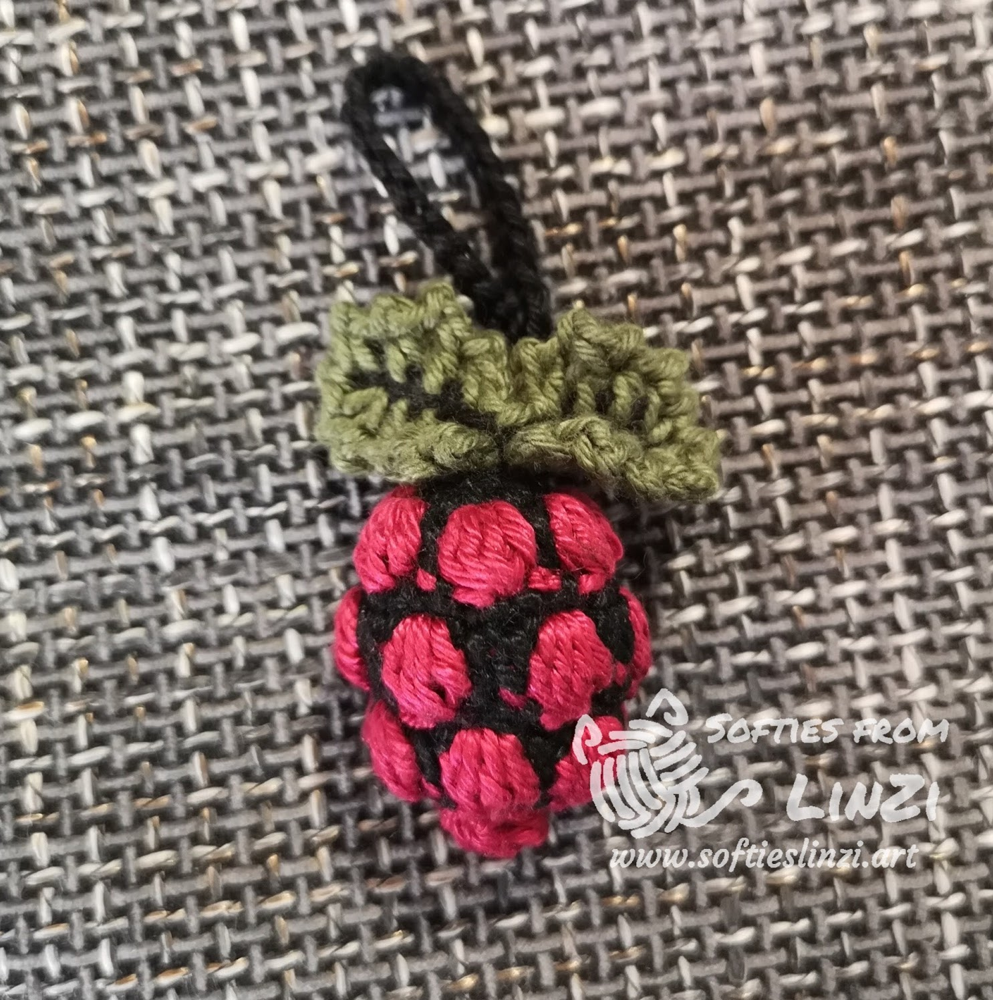

# IT Related Crochet Amigurumi Designs

## About Me

Hey! I am LinZi (Hz-Lin).

Since I am studying programming and a lot of people around me are doing IT related jobs, I begin to make IT related amigurumi (crocheted small stuffed toys). However I can not always find the crochet patterns online, so I start to design my own.

In the past I published some patterns by using the name Evelina Del Bosque on Ravelry. Later I realise my designs of the Docker Whale and Gopher (from GoLang) became popular, and I receiving more request about these kind of designs.

Therefore I rebranded my Ravelry store and created a new blog [Softies from LinZi](https://www.softieslinzi.art/).
Currently I am reviewing my old designs and try to create better new ones. I also plan to create more IT related amigurumi designs.

You can find me on:

- [Blogger](https://www.softieslinzi.art/)
- [Ravelry](https://www.ravelry.com/designers/huizhi-lin)
- [Instagram](https://www.instagram.com/softiesfromlinzi/)
- [Twitter](https://twitter.com/linzi_hz)

I will try to keep all the IT related patterns free. But if you want to support me, you can [Buy Me a Tea](https://www.buymeacoffee.com/hzlin)

## About this Repository

Pease note that I will not add PDFs to this repository anymore. In stead I will add links of patterns to this MarkDown file. I will only share the links about IT related designs here, but you are also welcome to checking my other designs on my Blogger or Ravelry.

There will be two sources of the patterns:

- my Blogger [softieslinzi.art](https://www.softieslinzi.art/), where you can see my patterns directly
- my [Ravelry Pattern store](https://www.ravelry.com/designers/huizhi-lin), where you can download the pdf (you may need a Ravelry account)

## Patterns

### Raspberry Pi Logo Amigurumi

- [Blogger Link](https://www.softieslinzi.art/2022/02/raspberry-pi-logo-amigurumi.html)
- [Ravelry PDF](https://www.ravelry.com/patterns/library/raspberry-pi-logo-amigurumi)
  ß
### Duke, the Java Mascot

- [Blogger Link](https://www.softieslinzi.art/2022/01/duke-java-mascot.html)
- [Ravelry PDF](https://www.ravelry.com/patterns/library/duke-the-java-mascot)

### Kubernetes and Tanzu logo keychain

- [Blogger Link](https://www.softieslinzi.art/2022/03/kubernetes-and-tanzu-keychain.html)
- [Ravelry PDF](https://www.ravelry.com/patterns/library/kubernetes-and-tanzu-keychain)

## Old Patterns

Here are the patterns I created in the past. I am currently reviewing them. You can still find these old PDFs in this repository.
I will update them when I have the new patterns ready.

PDF from Ravelry:

- [Tux from Linux](https://www.ravelry.com/patterns/library/tux-from-linux)
- [Gopher from Golang](https://www.ravelry.com/patterns/library/gopher-from-golang)
- [Docker Whale](https://www.ravelry.com/patterns/library/docker-whale-amigurumi)

## More to come

I plan to create more patterns. Here are some ideas

- Octocat from GitHub (I made this before, but I did not write down the pattern)
- Ferris from Rust
- Puffy from OpenBSD
- GEEKO from SUSE
- yellow elephant from Hadoop
- the ElePHPant from PHP
- gitkraken
